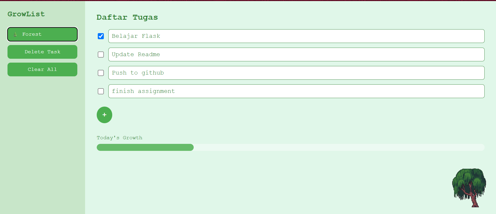
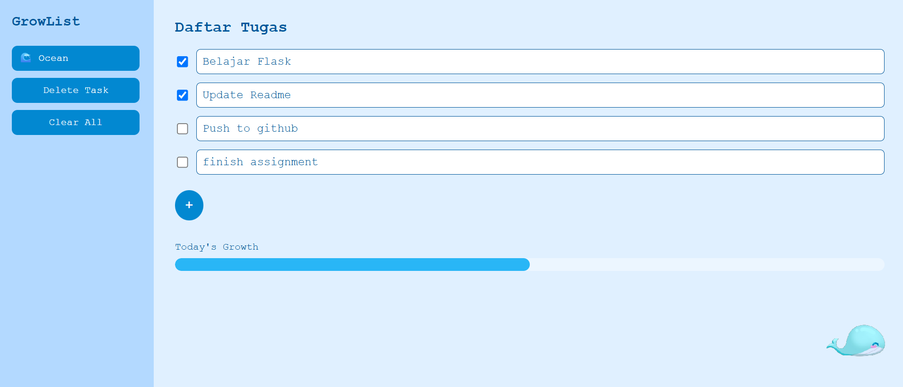
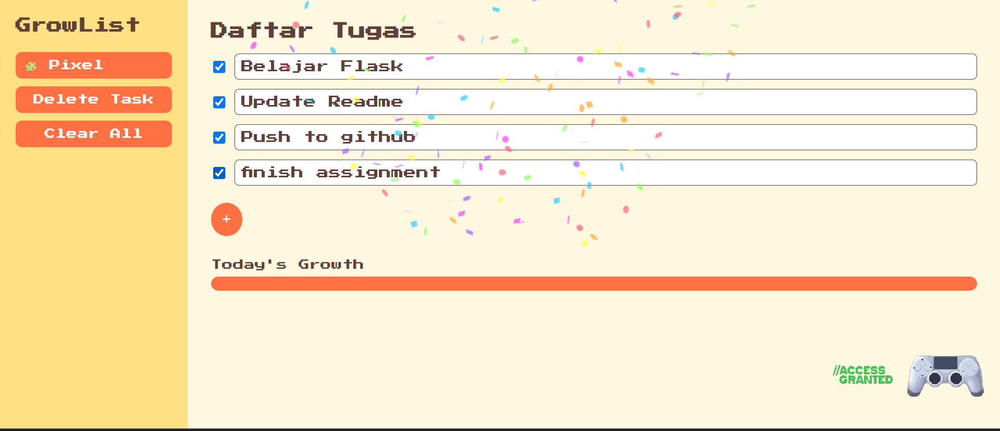

# 🌱 GrowList

GrowList is a simple web-based to-do list application built with Flask. It helps users organize daily tasks through a clean interface, multiple themes, and an interactive user experience.

🌐 **Live Demo:** https://adndaslh.pythonanywhere.com/

---

## 📷 Screenshot

> ## Forest theme:






---

##  Features

-  Add new tasks
-  Mark tasks as completed
-  Delete tasks
-  Save task history using Local Storage
-  Confetti animation when all tasks are completed
-  Three built-in themes
-  Progress Bar

---

##  Tech Stack

- Python
- Flask
- HTML5
- CSS3
- JavaScript

---

##  Run Locally

Clone this repository:

```bash
git clone https://github.com/adindasoleha64-byte/GrowList.git
cd GrowList
```

Install the required dependencies:

```bash
pip install -r requirements.txt
```

Run the application:

```bash
python app.py
```

---

## 📁 Project Structure

```
GrowList/
├── static/
├── templates/
├── app.py
├── requirements.txt
└── README.md
```

---

##  Author

**Adinda Soleha**

GitHub: https://github.com/adindasoleha64-byte